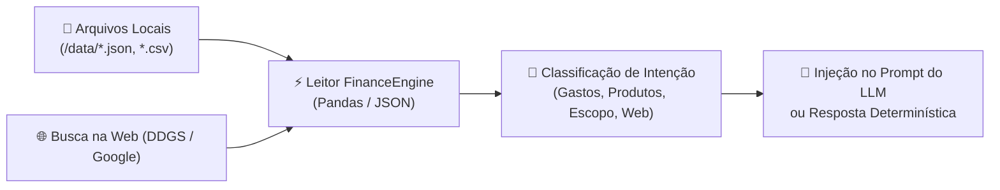

# Assets

Esta pasta é destinada a recursos visuais do seu projeto:

- Diagramas de arquitetura

Funiconamento:
 ```mermaid
flowchart TD
    A([Usuário envia mensagem no Chat]) --> B[Interface Streamlit src/app.py]
    B --> C{Classificador de Intenção e Escopo}
    C -- Fora de Escopo --> D[Recusa Educada de Escopo]
    C -- Pergunta Pessoal --> E[Leitor de Dados Locais /data]
    C -- Explicação de Produto --> F[Motor de Busca Web ao Vivo DDGS e Google]
    C -- Recomendação de Produto --> G[Filtro do Catálogo Oficial produtos_financeiros.json]
    E --> H[Geração de Resposta Grounded com Métricas]
    F --> H
    G --> H
    D --> H
    H --> I[Exibição Cronológica na Interface]
    I --> J[st.chat_input fixado no Final da Tela]
```

Como os dados são carregados:

  
- Screenshots da aplicação


  
- Mockups de interface


- Imagens para o README
