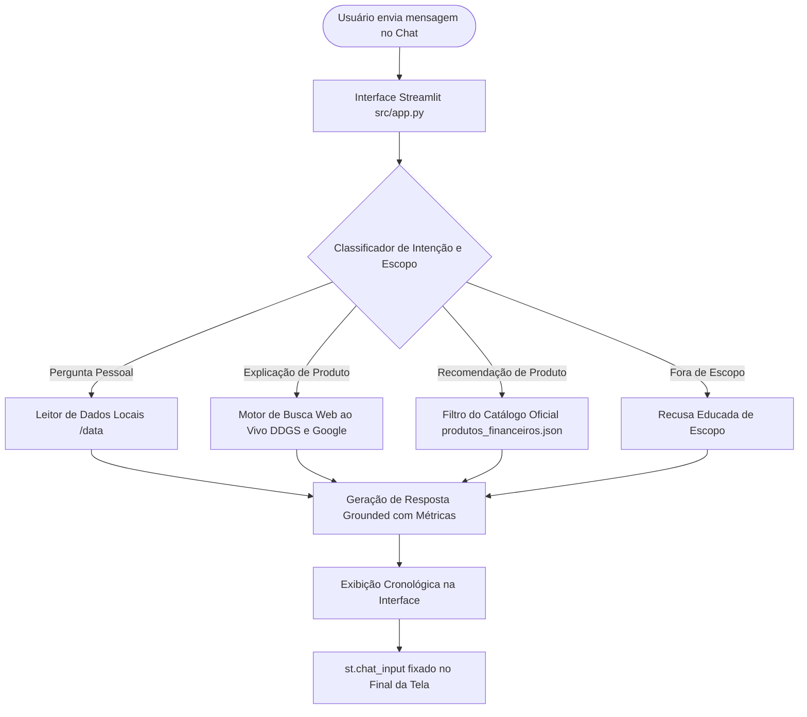

# 📄 Documentação de Arquitetura e Design — Agente Finn

---

## 1. Caso de Uso e Proposta de Valor

### Problema
A maioria das pessoas não sabe como organizar suas finanças pessoais nem como navegar no mercado de investimentos. Decisões financeiras costumam ser tomadas por impulso ou falta de orientação acessível. Consultores tradicionais cobram caro e focam em clientes de alta renda, deixando o cidadão comum sem suporte técnico e confiável.

---

### Solução
O agente **Finn** atua como um **consultor financeiro pessoal digital 24h**, acessível, empático e seguro. Ele:

- **Organiza** o orçamento do usuário com base nos lançamentos reais (`transacoes.csv`)
- **Calcula** saldo restante, comprometimento de renda e progresso de metas de emergência (`perfil_investidor.json`)
- **Explica** produtos financeiros (Tesouro Selic, CDB, LCI, LCA, FIIs) com busca na internet em tempo real e citações de fontes oficiais (Tesouro Nacional, BCB, CVM, ANBIMA)
- **Detector de Intenções Financeiras:** Analisa a pergunta do usuário para identificar palavras-chave estritamente financeiras (ex: investir, tesouro, selic, cdb, rentabilidade, orçamento, saldo, gastei, gastos, alimentação). Caso a pergunta fuja deste escopo (ex: previsão do tempo, esportes), o motor de regras intervém e retorna uma recusa educada antes mesmo da requisição ao LLM.
- **Mantém** o histórico de interações passadas para continuidade no atendimento (`historico_atendimento.csv`)

---

### Público-Alvo

| Perfil | Característica | Necessidade Principal |
|---|---|---|
| **Jovem adulto (20–30 anos)** | Primeiro emprego, sem cultura financeira | Organizar orçamento, começar a poupar |
| **Família de renda média** | Dívidas no cartão e financiamentos | Estratégia de quitação e equilíbrio mensal |
| **Autônomo / Freelancer** | Renda variável, sem FGTS | Reserva de emergência e gestão de fluxo |
| **Pessoa em transição** | Demissão, divórcio, mudança de cidade | Reorganização financeira urgente |

---

## 2. Persona e Tom de Voz

### 💬 Finn — Consultor Financeiro Pessoal Digital

* **Consultivo:** Não apenas responde o que foi perguntado; apresenta contexto, ressaltando comprometimento de renda e limites de risco.
* **Educativo:** Explica o funcionamento dos produtos, vantagens, desvantagens, tributação (IR/IOF) e garantias (FGC/Soberano).
* **Empático & Imparcial:** Trata o tema dinheiro sem julgamentos, falando como um mentor financeiro amigo.

---

## 3. Arquitetura do Sistema e Fluxo de Processamento



### Componentes Técnicos do Sistema

| Componente | Tecnologia | Responsabilidade |
|---|---|---|
| **Interface Visual** | Streamlit (`src/app.py`) | Painel responsivo com suporte a chat conversacional, indicadores de orçamento, painel de métricas e caixa de pergunta fixada no final da tela |
| **LLM & API Grounding** | Gemini API (`google.genai`) | Geração de respostas conversacionais com suporte a Google Web Search grounding (`types.Tool(google_search=...)`) usando `gemini-2.0-flash` / `gemini-1.5-flash` |
| **Engine Nativa (Fallback)** | Python (`finance_engine.py`) | Motor determinístico com `FinanceEngine`: calcula extratos, compara categorias, lista catálogo, explica produtos via `PRODUCT_KNOWLEDGE_BASE` e executa busca web com `fetch_live_web_search` (ddgs) em formato de prosa limpa (sem links) |
| **Base de Dados Pessoal** | `/data` (`.json`, `.csv`) | Ingestão dos 4 arquivos oficiais do cliente fictício (João Silva) |
| **Base de Conhecimento Educacional** | `PRODUCT_KNOWLEDGE_BASE` (dict embutido) | Dicionário estático com explicações ricas de Tesouro Selic, CDB, LCI, LCA, FIIs, Fundos de Ações, Selic, CDI e FGC com fontes oficiais |
| **Mecanismo de Hot-Reload** | `importlib.reload(finance_engine)` | Garante atualização em tempo de execução sem manter módulos obsoletos no cache da memória RAM |

---

## 4. Engenharia de Prompt e Estratégia Zero, One e Few-Shot

> **Referência de Engenharia de Prompt:** [Asimov Academy — Zero, One e Few-Shot Prompts](https://hub.asimov.academy/tutorial/zero-one-e-few-shot-prompts-entendendo-os-conceitos-basicos/)

A engenharia do Prompt do Finn (`finn_system_prompt.md`) combina três técnicas fundamentais:

* **Zero-Shot Prompting:** Utilizado na imposição de regras de segurança e bloqueio de escopo não financeiro. O modelo identifica e recusa tópicos fora de seu domínio diretamente por instrução.
* **One-Shot Prompting:** Utilizado para padronizar o tom de voz conversacional e o formato dos painéis de métricas de qualidade.
* **Few-Shot Prompting (Estratégia Principal):** Injeção de múltiplos cenários de exemplo (Seção 7 do Prompt) demonstrando o cruzamento exato de dados de `transacoes.csv`, `perfil_investidor.json` e busca web. Isso elimina alucinações e estabelece o padrão visual em Markdown.

---

## 5. Segurança, Validação e Anti-Alucinação

1. **Recusa Estrita Fora de Escopo:** Consultas sobre clima, esportes, culinária, política, geografia, eletrônicos e tarefas domésticas são interceptadas por `classify_out_of_scope()` com mensagens de recusa categorizadas por tema (7 categorias cobertas).
2. **Validação Financeira Secundária:** Após a verificação de escopo, `is_financial_query()` confirma que a pergunta trata de tema financeiro/econômico antes de responder.
3. **Recomendação Restrita ao Catálogo:** O assistente está **estritamente impedido** de sugerir compras de produtos que não estejam em `produtos_financeiros.json`.
4. **Busca Web com Fontes Oficiais:** As explicações de produtos utilizam: (a) `PRODUCT_KNOWLEDGE_BASE` local com citações de fontes oficiais (Tesouro Nacional, BCB, CVM, ANBIMA, B3, FGC); (b) busca ao vivo via `fetch_live_web_search()` com `ddgs`; (c) Google Search Grounding via Gemini API.
5. **Precisão Matemática sobre Extratos:** Todo cálculo de orçamento e saldo restante é efetuado diretamente sobre os dados do `transacoes.csv`.

---

## 6. Layout e Experiência do Usuário (UX)

- **Caixa de Entrada Fixada no Final (`st.chat_input`):** Posicionada **após** o laço de renderização das mensagens no `src/app.py`, garantindo que o campo de digitação fique **sempre abaixo de todas as respostas** na tela.
- **Interface Limpa e Focada:** As métricas de qualidade (Escopo, Grounding, Cortesia) rodam em background e foram ocultadas da interface principal para não distrair o usuário, focando na conversa.
- **Perguntas Rápidas:** Botões superiores para acionamento com um clique dos testes principais do cliente.
- **Tema Dark/Glassmorphism:** Interface com tipografia Inter, gradientes modernos, cards com bordas suaves e paleta de cores HSL/roxo premium.

---

## 7. Fluxo de Decisão da Engine Nativa (`finance_engine.py`)

```
Pergunta do Usuário
  → classify_out_of_scope() → [Recusa categorizada por tema]
  → is_financial_query() → [Recusa genérica se não financeiro]
  → Classificação de Intenção:
      is_catalog_list_question()         → answer_catalog_list()
      is_spending_by_category_question() → answer_spending_by_category()
      is_food_expense_question()         → answer_food_expenses()
      is_category_comparison_question()  → answer_category_comparison()
      is_monthly_balance_question()      → answer_monthly_balance()
      is_emergency_recommendation_question() → answer_emergency_recommendation()
      is_goal_progress_question()        → answer_goal_progress()
      is_lowest_minimum_question()       → answer_lowest_minimum()
      is_tesouro_history_question()      → answer_tesouro_history()
      is_frequent_topics_question()      → answer_frequent_topics()
      is_generic_simulation_question()   → answer_generic_simulation()
                                           (Suporta simulação direta e reversa para múltiplos produtos)
      is_apartment_goal_question()       → answer_apartment_goal()
      is_unknown_product_question()      → answer_unknown_product()
      is_generic_recommendation_question() → answer_emergency_recommendation()
      is_product_comparison_question()   → answer_product_comparison()
      is_product_explanation_question()  → answer_product_explanation()
                                           (usa PRODUCT_KNOWLEDGE_BASE + fetch_live_web_search)
      is_profile_no_risk_question()      → answer_profile_no_risk()
      is_history_overview_question()     → answer_history_overview()
      Fallback                           → fetch_live_web_search() → resposta grounded
```

---

*Documentação de Design do Agente Finn — Versão Final 2.1*
