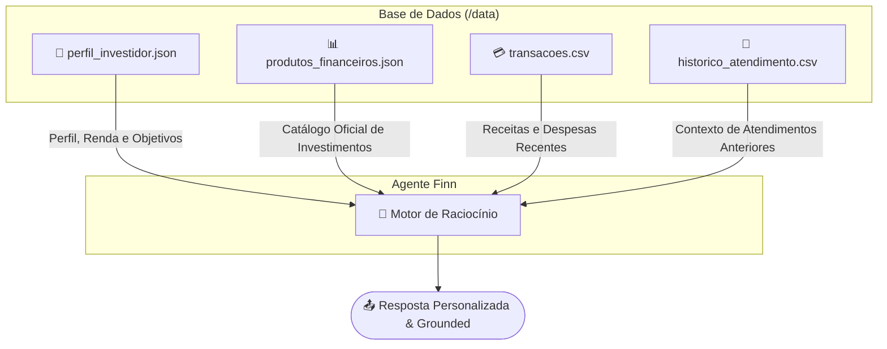
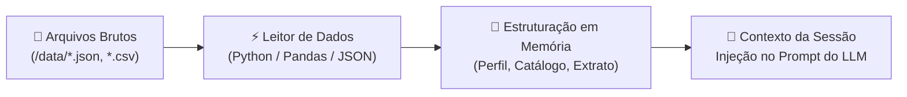

# 🗄️ Estrutura da Base de Conhecimento — Agente Finn

> **Repositório de Origem dos Dados:**  
> `https://github.com/Mister-N-Oliveira/dio-lab-bia-do-futuro/tree/main/data`

---

## 1. Visão Geral dos Arquivos de Dados

O agente Finn consome **4 fontes de dados oficiais** localizadas no repositório para personalizar atendimentos, analisar extratos e sugerir produtos adequados ao perfil do cliente:



---

## 2. Mapeamento e Esquema dos Arquivos

### 👤 `perfil_investidor.json`
Contém os dados cadastrais, situação financeira atual e perfil de risco do cliente.

* **Função no Agente:** Define os limites de risco para recomendações e contextualiza o patrimônio atual.
* **Exemplo de Estrutura:**
```json
{
  "nome": "João Silva",
  "idade": 32,
  "profissao": "Analista de Sistemas",
  "renda_mensal": 5000.00,
  "perfil_investidor": "moderado",
  "objetivo_principal": "Construir reserva de emergência",
  "patrimonio_total": 15000.00,
  "reserva_emergencia_atual": 10000.00,
  "aceita_risco": false
}
```

---

### 📊 `produtos_financeiros.json`
Catálogo de produtos financeiros liberados para consulta e recomendação pelo Finn.

* **Função no Agente:** O Finn **só pode recomendar** produtos presentes neste catálogo, respeitando o alinhamento com o `perfil_investidor.json`.
* **Exemplo de Estrutura:**
```json
[
  {
    "nome": "Tesouro Selic",
    "categoria": "renda_fixa",
    "risco": "baixo",
    "rentabilidade": "100% da Selic",
    "aporte_minimo": 30.00,
    "indicado_para": "Reserva de emergência e iniciantes"
  },
  {
    "nome": "CDB Liquidez Diária",
    "categoria": "renda_fixa",
    "risco": "baixo",
    "rentabilidade": "102% do CDI",
    "aporte_minimo": 100.00,
    "indicado_para": "Quem busca segurança com liquidez imediata"
  }
]
```

---

### 💳 `transacoes.csv`
Histórico detalhado de movimentações financeiras (entradas e saídas) do usuário.

* **Função no Agente:** Permite ao Finn calcular orçamento real, identificar vilões de gastos (ex: lazer, farmácia, aluguel) e propor planos de ação proativos.
* **Esquema:** `data,descricao,categoria,valor,tipo`
* **Exemplo de Conteúdo:**
```csv
data,descricao,categoria,valor,tipo
2025-10-01,Salário,receita,5000.00,entrada
2025-10-02,Aluguel,moradia,1200.00,saida
2025-10-03,Supermercado,alimentacao,450.00,saida
2025-10-05,Netflix,lazer,55.90,saida
2025-10-07,Farmácia,saude,89.00,saida
```

---

### 💬 `historico_atendimento.csv`
Registro de conversas e dúvidas passadas do usuário com o suporte/agente.

* **Função no Agente:** Oferece memória conversacional de longo prazo, evitando repetições de perguntas e mantendo o tom contínuo de mentoria.
* **Esquema:** `data,canal,tema,resumo,resolvido`
* **Exemplo de Conteúdo:**
```csv
data,canal,tema,resumo,resolvido
2025-09-15,chat,CDB,Cliente perguntou sobre rentabilidade e prazos,sim
2025-09-22,telefone,Problema no app,Erro ao visualizar extrato foi corrigido,sim
2025-10-01,chat,Tesouro Selic,Cliente pediu explicação sobre o funcionamento do Tesouro Direto,sim
```

---

## 3. Como o Agente cruza os dados em tempo de execução

| Solicitação do Usuário | Arquivos Consultados | Ação do Finn |
|---|---|---|
| *"Quais opções de investimento combinam comigo?"* | `perfil_investidor.json` + `produtos_financeiros.json` | Filtra produtos do catálogo cujo `risco` e `indicado_para` coincidam com o `perfil_investidor` e o `objetivo_principal`. |
| *"Como estão meus gastos este mês?"* | `transacoes.csv` + `perfil_investidor.json` | Soma as saídas por `categoria` em `transacoes.csv` e compara o total gasto em relação à `renda_mensal`. |
| *"Já perguntei sobre Tesouro Selic antes?"* | `historico_atendimento.csv` | Busca ocorrências no tema `Tesouro Selic` e relembra o atendimento prévio registrado. |

---

## 4. Como os Dados São Carregados?

O processo de ingestão e carregamento dos dados pela aplicação segue 4 etapas principais:



### Etapas da Carga de Dados

1. **Leitura dos Arquivos Brutos:**
   * Na inicialização do agente ou no início da sessão do usuário, a aplicação lê os arquivos diretamente do diretório `/data/`:
     * `perfil_investidor.json` via módulo `json`
     * `produtos_financeiros.json` via módulo `json`
     * `transacoes.csv` via `pandas` (ou leitor CSV nativo)
     * `historico_atendimento.csv` via `pandas` (ou leitor CSV nativo)

2. **Parsing e Estruturação:**
   * **Perfil:** Convertido em um dicionário Python contendo as variáveis do cliente (renda, perfil de risco, reserva atual).
   * **Produtos Financeiros:** Carregados como uma lista de objetos estruturados para busca e filtragem por categoria e risco.
   * **Transações:** Convertidas em tabela/DataFrame com colunas tipadas (`data` em formato datetime, `valor` em float, `tipo` em string).
   * **Histórico:** Filtrado por ID/sessão do cliente para recuperar as últimas interações.

3. **Injeção de Contexto no Prompt (RAG Simples / Grounding):**
   * Os dados processados são formatados como texto estruturado e injetados diretamente na mensagem do usuário ou nas `system_instructions` da API do LLM (Gemini):
     ```text
     [CONTEXTO DO CLIENTE]
     Perfil: Moderado | Renda: R$ 5.000,00 | Reserva Atual: R$ 10.000,00

     [EXTRATO RECENTE]
     - 2025-10-01: Salário (+ R$ 5.000,00)
     - 2025-10-02: Aluguel (- R$ 1.200,00)
     ...

     [CATÁLOGO DE PRODUTOS DISPONÍVEIS]
     - Tesouro Selic (Renda Fixa | Risco: Baixo | Rentabilidade: 100% Selic)
     ...
     ```

4. **Processamento do LLM:**
   * O LLM recebe a pergunta do usuário acompanhada desse contexto pré-carregado e gera a resposta fundamentada (*grounded*) unicamente nestas informações.

---

## 5. Regras de Segurança Anti-Alucinação para a Base

1. **Catálogo Fechado:** O Finn está **estritamente proibido** de citar fundos, ações ou produtos financeiros que não constem em `produtos_financeiros.json`.
2. **Fidelidade aos Dados Pessoais:** Qualquer cálculo de orçamento deve ser feito **estritamente sobre** as linhas de `transacoes.csv` e a `renda_mensal` de `perfil_investidor.json`.
3. **Respeito ao Perfil:** Se `aceita_risco: false`, o Finn **jamais** poderá sugerir produtos com `risco` alto ou médio presentes no catálogo.

---

*Especificação da Base de Conhecimento — Agente Finn v1.0*
