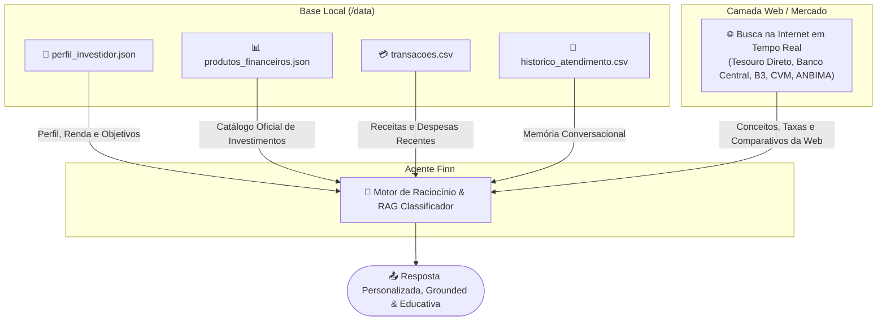
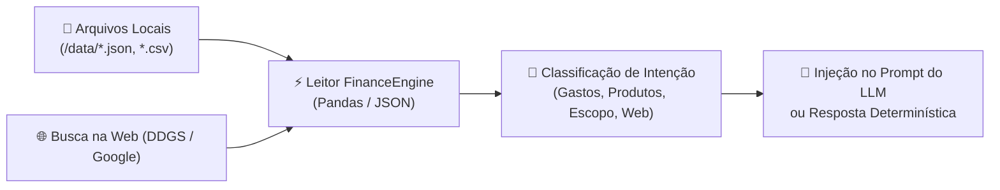

# 🗄️ Estrutura da Base de Conhecimento — Agente Finn

> **Repositório de Origem dos Dados:**  
> `https://github.com/Mister-N-Oliveira/dio-lab-bia-do-futuro/tree/main/data`

---

## 1. Visão Geral das Fontes de Dados

O agente Finn consome **duas camadas complementares de dados** para responder com precisão e riqueza educativa:

1. **Base Local de Dados Pessoais (`/data`):** Contém os 4 arquivos do cliente fictício (João Silva).
2. **Camada de Busca e Conhecimento Web (Tempo Real):** Para explicações de produtos, conceitos e cotações de mercado via busca ao vivo (Google Search / DDGS).



---

## 2. Mapeamento e Esquema dos Arquivos Locais (`/data`)

### 👤 `perfil_investidor.json`
Contém os dados cadastrais, situação financeira atual e perfil de risco do cliente.
* **Função no Agente:** Define os limites de risco para recomendações e contextualiza o patrimônio atual.

```json
{
  "nome": "João Silva",
  "idade": 32,
  "profissao": "Analista de Sistemas",
  "renda_mensal": 5000.00,
  "perfil_investidor": "moderado",
  "objetivo_principal": "Construir reserva de emergência",
  "patrimonio_total": 15000.00,
  "reserva_emergencia_atual": 10000.00,
  "aceita_risco": false
}
```

---

### 📊 `produtos_financeiros.json`
Catálogo oficial de produtos financeiros liberados para recomendação direta pelo Finn.
* **Função no Agente:** O Finn **só pode recomendar** compra de produtos presentes neste catálogo, respeitando o alinhamento com o `perfil_investidor.json`.

```json
[
  {
    "nome": "Tesouro Selic",
    "categoria": "renda_fixa",
    "risco": "baixo",
    "rentabilidade": "100% da Selic",
    "aporte_minimo": 30.00,
    "indicado_para": "Reserva de emergência e iniciantes"
  },
  {
    "nome": "CDB Liquidez Diária",
    "categoria": "renda_fixa",
    "risco": "baixo",
    "rentabilidade": "102% do CDI",
    "aporte_minimo": 100.00,
    "indicado_para": "Quem busca segurança com liquidez imediata"
  }
]
```

---

### 💳 `transacoes.csv`
Histórico detalhado de movimentações financeiras (entradas e saídas) de outubro.
* **Função no Agente:** Permite ao Finn calcular orçamento real, totalizar receitas e despesas por categoria (`moradia`, `alimentacao`, `saude`, `lazer`, `transporte`) e calcular comprometimento da renda.

```csv
data,descricao,categoria,valor,tipo
2025-10-01,Salário,receita,5000.00,entrada
2025-10-02,Aluguel,moradia,1200.00,saida
2025-10-03,Supermercado,alimentacao,450.00,saida
2025-10-05,Netflix,lazer,55.90,saida
2025-10-07,Farmácia,saude,89.00,saida
```

---

### 💬 `historico_atendimento.csv`
Registro de conversas e dúvidas passadas do usuário com o atendimento.
* **Função no Agente:** Oferece memória conversacional de longo prazo, evitando repetições de perguntas e mantendo o histórico de atendimento.

---

## 3. Base Educacional e Busca Web em Tempo Real

Quando o usuário pede **explicações**, **conceitos**, **taxas atuais** ou **comparações de investimentos**, o Finn executa busca ao vivo na internet e utiliza dados de instituições oficiais:

| Conceito / Produto | Fonte Oficial | Tópicos Cobertos |
|---|---|---|
| **Tesouro Selic (LFT)** | Tesouro Nacional (tesouro.gov.br) | Garantia soberana, liquidez D+1, rentabilidade Selic, tabela regressiva de IR |
| **CDB** | Banco Central / FGC / ANBIMA | Cobertura do FGC (R$ 250 mil), rentabilidade % do CDI, liquidez diária vs carência |
| **LCI / LCA** | Banco Central / CVM | Isenção de IR e IOF para pessoas físicas, lastro imobiliário/agronegócio, carência |
| **FIIs (Fundos Imobiliários)** | CVM / B3 | Rendimentos mensais isentos de IR, volatilidade na B3, risco de vacância e gestão |
| **Fundos de Ações** | CVM / ANBIMA | Renda variável, diversificação, come-cotas, taxa de administração e performance |
| **Taxa Selic & CDI** | Banco Central / B3 | Taxa básica de juros, reuniões do COPOM, relação entre Selic Over e CDI |
| **FGC (Fundo Garantidor)** | fgc.org.br | Limite de R$ 250.000 por CPF/instituição, teto global de R$ 1 milhão a cada 4 anos |

---

## 4. Como os Dados São Carregados e Processados



1. **Processamento Local Determinístico:** Perguntas sobre gastos, saldo, reserva de emergência e lista de produtos são calculadas via `FinanceEngine` com dados dos arquivos locais.
2. **Integração Web Grounding:** Perguntas sobre produtos, comparações e conceitos realizam buscas web em tempo real e trazem links com URLs oficiais.
3. **Bloqueio de Escopo:** Consultas não financeiras (ex: previsão do tempo, esportes, culinária) são filtradas e recusadas educadamente.

---

## 5. Regras de Segurança Anti-Alucinação para a Base

1. **Catálogo Fechado de Recomendação:** O Finn está **estritamente proibido** de recomendar compra de produtos que não constem em `produtos_financeiros.json`.
2. **Fidelidade Matemática aos Dados:** Cálculos de despesas e saldo devem refletir exatamente as linhas de `transacoes.csv`.
3. **Respeito ao Perfil do Cliente:** Se `aceita_risco: false`, o Finn **jamais** sugerirá produtos com `risco` alto ou médio.
4. **Recusa Transparente Fora de Escopo:** Qualquer tema alheio a finanças pessoais gera recusa imediata declarando a especialidade restrita do agente.

---

*Especificação da Base de Conhecimento — Agente Finn v2.0*
